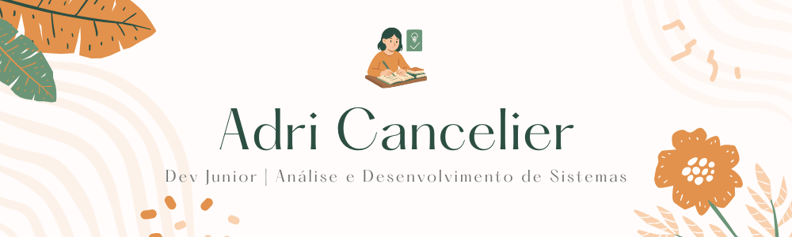

  

<h1 align="center"> Adrieli Cancelier </h1>

Desenvolvedora em formação, fotógrafa há 12 anos e apaixonada por tecnologia.

---

## Sobre mim

Dev Backend Júnior.
Profissional em transição de carreira em busca de estágio na área.  
Cursando Análise e Desenvolvimento de Sistemas.

---

## Cursos Livres Concluídos

- Começando em Programação: carreira e primeiros passos – Alura  
- Git e GitHub: compartilhando e colaborando em projetos – Alura  
- Lógica de programação: explore funções e listas – Alura  
- Lógica de programação: mergulhe em programação com JavaScript – Alura  

*Curso atual:* Lógica de programação: praticando com desafios – Alura

---

## Habilidades Técnicas

- JavaScript (básico)
- Python (Básico)
- GitHub  
- Lógica de programação  

---

## 🌍 Contato

- GitHub: [@adricancelier](https://github.com/adricancelier)  
- LinkedIn: [@adrielicancelier](https://www.linkedin.com/in/adrielicancelier)  
- Email: [adricancelier@gmail.com](mailto:adricancelier@gmail.com)
